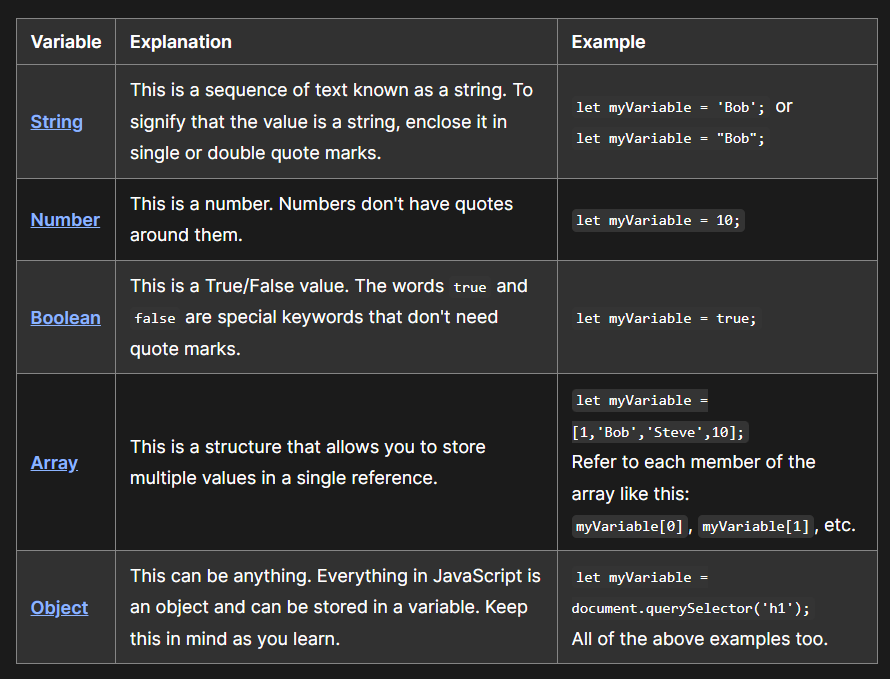
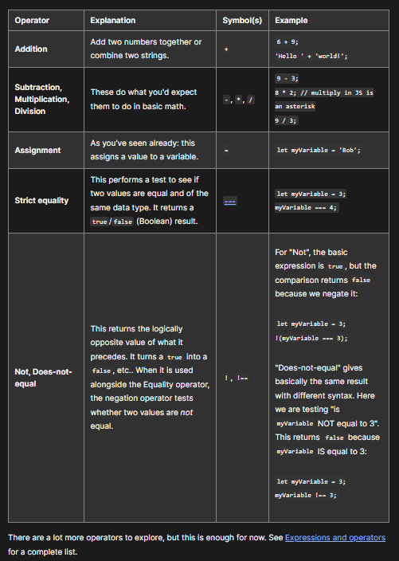

# JavaScript Bascis

JavaScript is a programming language that adds interactivity to your website. It was invented by Brendan Eich.

The reason the instruction to place the `<script>` element near the bottom of the HTML file is that the browser reads code in the order it appears in the file. If the JavaScript loads first and it is supposed to affect the HTML that hasn't loaded yet, there could be problems. Placing JavaScript near the bottom of an HTML page is one way to accommodate this dependency. 

### Hello World Example

- In your index.html file, enter this code on a new line, just before the closing `</body>` 

  tag: `<script src="scripts/main.js"></script>`
- Add this code to the main.js file:

  ```JavaScript
  const myHeading = document.querySelector("h1");
  myHeading.textContent = "Hello world!";
  ```

- The heading text changed to Hello world! using JavaScript. 

- using a function called `querySelector()` to grab a reference to your heading, and then store it in a variable called `myHeading`. This is similar to what we did using CSS selectors. When you want to do something to an element, you need to select it first.
- Following that, the code set the value of the `myHeading` variable's `textContent` property (which represents the content of the heading) to Hello world!.


## Variables

- Variables are containers that store values. 
- JavaScript is case sensitive. 
- Everything in JavaScript is an object and can be stored in a variable. 

  

## Operators

- An operator is a mathematical symbol that produces a result based on two values (or variables).
 
  


## Functions

- Functions are a way of packaging functionality that you wish to reuse. It's possible to define a body of code as a function that executes when you call the function name in your code.

- ```JavaScript
  document.querySelector("html").addEventListener("click", function () {
  alert("Ouch! Stop poking me!");
  });
  ```

- ```JavaScriptdocument.querySelector("html").addEventListener("click", () => {
  alert("Ouch! Stop poking me!");
  });
  ```

- The function we just passed to `addEventListener()` here is called an `anonymous function `, because it doesn't have a name. There's an alternative way of writing anonymous functions, which we call an `arrow function `. An arrow function uses `() => instead of function ()`

- ```JavaScript
  function setUserName() {
  const myName = prompt("Please enter your name.");
  localStorage.setItem("name", myName);
  myHeading.textContent = 'Mozilla is cool, ${myName}';
  }
  ```

- The `setUserName()` function contains a `prompt()` function, which displays a dialog box, similar to `alert()`. This `prompt()` function does more than `alert()`, asking the user to enter data, and storing it in a variable after the user clicks OK. In this case, we are asking the user to enter a name. Next, the code calls on an API `localStorage`, which allows us to store data in the browser and retrieve it later. We use localStorage's `setItem()` function to create and store a data item called `'name'`, setting its value to the myName variable which contains the user's entry for the name. Finally, we set the `textContent` of the heading to a string, plus the user's newly stored name.


